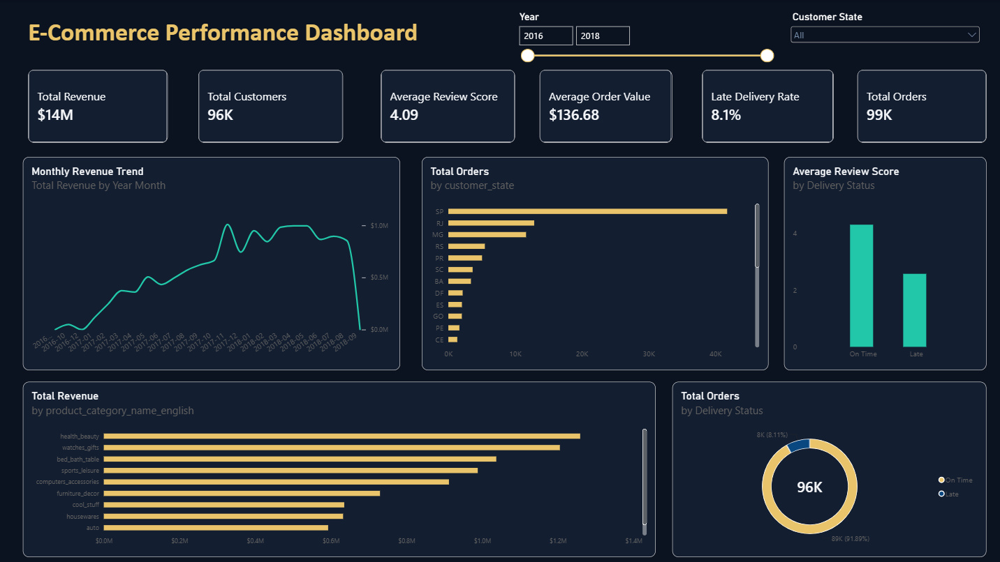

# E-Commerce Performance Dashboard

An interactive Power BI dashboard built to analyze e-commerce sales, customer activity, product performance, reviews, and delivery efficiency. The report turns transactional data into a concise executive view with time and customer-state filtering.



## Project Overview

The dashboard helps business stakeholders answer five practical questions:

- How much revenue is the business generating over time?
- Which product categories contribute the most revenue?
- Which customer states generate the most orders?
- How effectively are orders delivered on time?
- How does delivery performance affect customer reviews?

## Key Results

| KPI | Result |
|---|---:|
| Total Revenue | **$14M** |
| Total Orders | **99K** |
| Total Customers | **96K** |
| Average Order Value | **$136.68** |
| Average Review Score | **4.09** |
| Late Delivery Rate | **8.1%** |

## Dashboard Features

- KPI cards for revenue, orders, customers, order value, reviews, and delivery performance
- Monthly revenue trend analysis
- Revenue breakdown by product category
- Geographic order analysis by customer state
- On-time versus late delivery comparison
- Review score analysis by delivery status
- Interactive year and customer-state filters

## Tools and Skills

- **Power BI** — data modelling, DAX measures, interactive reporting, and dashboard design
- **Power Query** — data cleaning, type validation, and transformation
- **Data Modelling** — relationships across orders, order items, products, customers, payments, and reviews
- **Data Visualization** — KPI design, trend analysis, category comparison, and geographic segmentation

## Repository Structure

```text
ecommerce-sales-dashboard/
├── assets/
│   └── ecommerce-dashboard.png
├── Olist_Ecommerce_Dashboard.pbix
└── README.md
```

## How to View the Dashboard

1. Download `Olist_Ecommerce_Dashboard.pbix`.
2. Open it using [Microsoft Power BI Desktop](https://powerbi.microsoft.com/desktop/).
3. Use the year slider and customer-state selector to explore the report.

If Power BI Desktop is unavailable, the dashboard preview above shows the complete report layout.

## Business Insights

- Sales reached approximately **$14M** across **99K orders**.
- The business served approximately **96K customers**, indicating that repeat purchasing is limited and represents a potential growth opportunity.
- Approximately **91.9% of deliveries were on time**, while late deliveries accounted for **8.1%** of orders.
- On-time deliveries received substantially stronger review scores than late deliveries, highlighting delivery performance as an important customer-satisfaction driver.
- Health and beauty, watches and gifts, and bed/bath/table were among the strongest revenue-generating categories in the dashboard view.

## Author

**Shilpa Siddharaju**  
Data Analyst | Data Science | Power BI | Python | SQL
